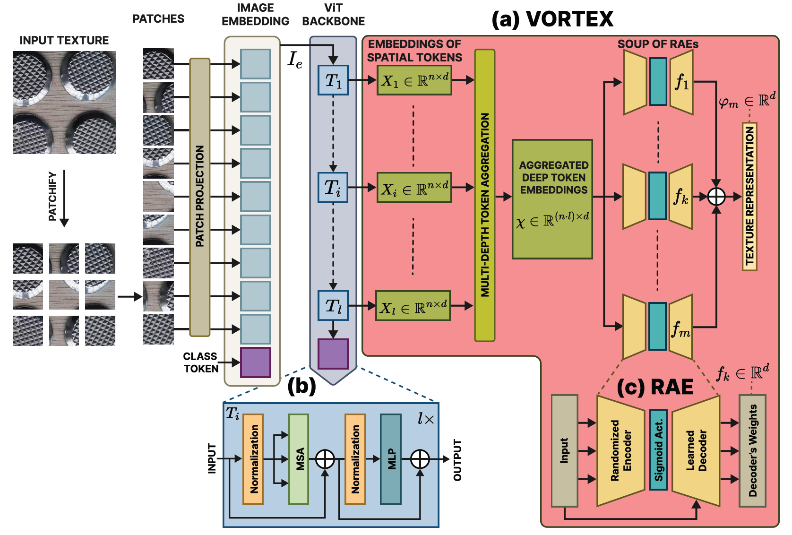
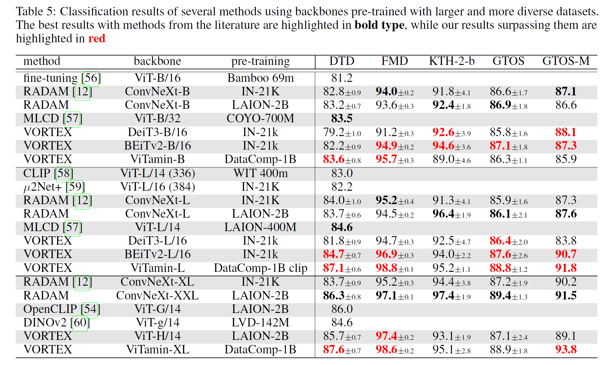

# VORTEX: SURPASSING CNNS AT TEXTURE RECOGNITION BY USING VISION TRANSFORMERS WITH ORDERLESS AND RANDOMIZED TOKEN ENCODINGS

VORTEX uses pre-trained Vision Transformers (ViTs) available in ```timm==1.0.11``` for texture feature extraction, and then "classic" machine learning classification is done with ```scikit-learn``` classifiers. Several dataloaders are available for texture benchmarks, see ```datasets.py```. VORTEX works with any ViT backbone with the usual transformer architecture (check the backbones used in the paper, but you may try other architectures to see if it works with them too) . See ```demo.ipynb``` to get started.

<p align="center">
    
</p>

VORTEX achieves state-of-the-art texture recognition performance without ever fine-tuning the ViT backbones, and using only a linear SVM for classification.

<p align="center">
    
</p>

## Usage of the VORTEX module

* Check ```demo.ipynb```

#### Creating a VORTEX feature extractor 
```python
from models import VORTEX
## Define the backbone according to models available in 'timm'
backbone = 'beitv2_base_patch16_224.in1k_ft_in22k_in1k'
input_size = 224 # input size must be fixed according to the selected ViT backbone

VORTEX_feature_extractor = VORTEX(backbone, input_size)
```

#### Extracting features for a given image or batch 
```python
from torchvision import transforms
from PIL import Image

## Load an image
image_path = "figures/texture_sample.jpg"  # Replace with your image path
image = Image.open(image_path)

# Resize to the backbone's input size, imagenet normalizaztion, and convert to tensor
transform = transforms.Compose([
    transforms.ToTensor(),
    transforms.Normalize((0.485, 0.456, 0.406), (0.229, 0.224, 0.225)),
    transforms.Resize((input_size, input_size)),
])
image_tensor = transform(image)

# Obtain the VORTEX features for the image (or a batch of images)
features = VORTEX_feature_extractor(image_tensor.unsqueeze(0))
```


## Requirements

These are main packages to use the VORTEX module. Check `requirements.txt` to see the full list of packages used in our experiments and analyses (such as scikit-learn).

* pytorch     : 2.4.0
* torchvision : 0.19.0
* timm        : 1.0.11
* einops      : 0.4.1


## Setup used for experiments

* Linux Ubuntu x86-64 18.04.5 LTS (Bionic Beaver)
* Intel(R) Core(TM) i7-7820X CPU @ 3.60GHz, 64GB RAM
* GTX 1080 ti, NVIDIA driver Version: 470.141.03, CUDA Version: 11.4

## Additional resources

* Dataloaders for many texture datasets, see ```datasets.py```
* Script for experimentation, see ```classify_features.py```

## Usage of the script for experiments
* See ```python classify_features.py --help``` for usage information. An example with VORTEX:

```
python classify_features.py --model beitv2_base_patch16_224.in1k_ft_in22k_in1k --pooling VORTEX --dataset DTD --data_path /datasets/ --output_path /results/
```

Pay attention to args: 

 * ```--data_path``` (path to load/download datasets)
 * ```--output_path``` (path to save extracted features and classification results, need 2 subfolders inside: feature_matrix/ and classification/)
